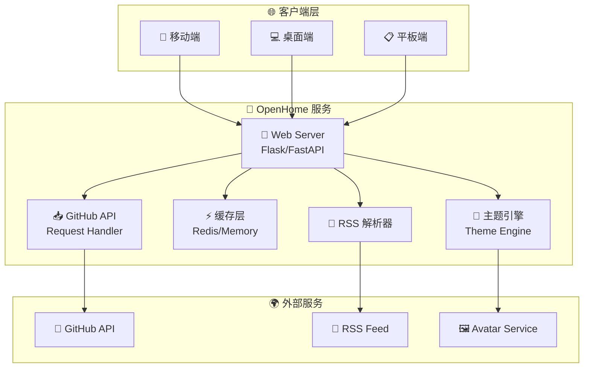
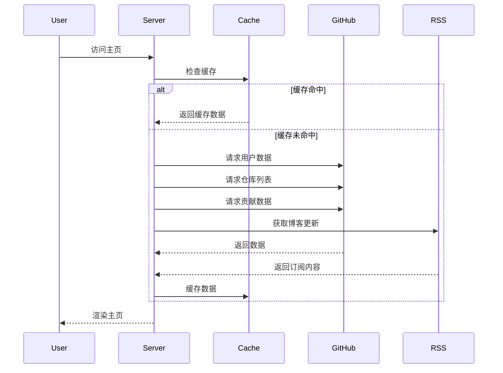
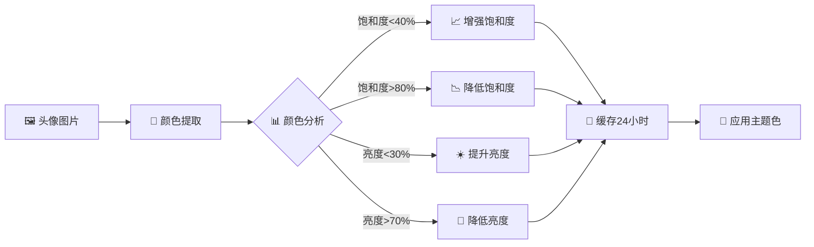
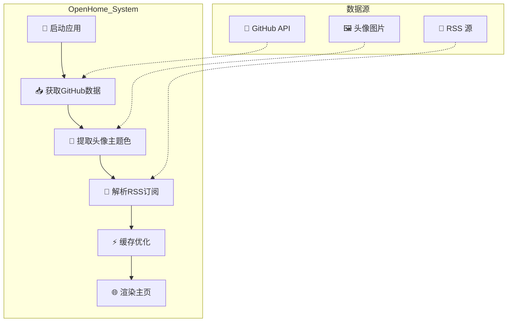

<!-- markdownlint-disable MD041 -->
<div align="center">

<picture>
  <source media="(prefers-color-scheme: dark)" srcset="https://img.shields.io/badge/OpenHome-FFFFFF?style=for-the-badge&logo=github&logoColor=white&color=6366f1">
  <source media="(prefers-color-scheme: light)" srcset="https://img.shields.io/badge/OpenHome-FFFFFF?style=for-the-badge&logo=github&logoColor=black&color=6366f1">
  
</picture>

# 🎯 OpenHome | 现代化个人主页生成器

✨ **一款让开发者爱不释手的个人主页** · 🚀 **开箱即用** · 📱 **响应式设计**


---

[📖 文档](https://github.com/none-ai/openhome#-安装方式) ·
[🚀 快速开始](#-快速开始) ·
[💬 讨论](https://github.com/none-ai/openhome/discussions) ·
[🐛 问题反馈](https://github.com/none-ai/openhome/issues) ·
[❤️ 赞助](https://github.com/sponsors/none-ai)

</div>

---

## 📸 效果预览


---

## 🏗️ 系统架构



### 🔄 数据流架构



### 🎨 主题提取流程



---

## ⭐ 为什么选择 OpenHome？

| 特性 | 说明 |
|------|------|
| 🚀 **开箱即用** | 一句话配置，立即拥有专业个人主页 |
| 🎨 **智能主题色** | 自动从头像提取主题色，永远和谐统一 |
| ⚡ **极速加载** | 颜色缓存24小时，GitHub API优化 |
| 📱 **响应式设计** | 手机、平板、桌面完美适配 |
| 🔧 **完全可定制** | YAML配置，想要的都能实现 |
| 🆓 **免费开源** | MIT协议，永久免费 |

---

## 🏆 核心功能

### 1. 智能主题色 🎨
自动从你的 GitHub 头像提取主色调，智能调整饱和度和亮度，让页面永远保持视觉和谐。再也不必纠结配色方案！

### 2. GitHub 数据展示 📊
- 公开仓库按 Star 数排序展示
- 贡献热力图（Heatmap）
- 一键查看项目详情

### 3. RSS 订阅聚合 📰
支持多个 RSS 源，一个页面展示你的所有博客更新。读者无需四处寻找，自动聚合！

### 4. 完整社交链接 🔗
GitHub、邮箱、Twitter、博客...一个页面展示所有社交入口。

---

## 📦 安装方式

### 方式一：pip 安装（推荐）

```bash
pip install openhome
openhome
```

### 方式二：源码运行

```bash
git clone https://github.com/none-ai/openhome.git
cd openhome
pip install -r requirements.txt
python app.py
```

### 方式三：一句话配置

```bash
# 只需一行命令，自动生成配置
python setup.py --github 你的GitHub用户名
python app.py
```

---

## ⚡ 快速开始

### 1. 配置

复制示例配置文件：

```bash
cp config.example.yaml config.yaml
```

编辑 `config.yaml`，修改以下内容：

```yaml
# GitHub用户名
github_username: "your-github-username"

# GitHub Token（可选，用于提高API调用限制）
github_token: "ghp_xxxxxxxxxxxxxxxxxxxx"

# 端口号
port: 8004

# RSS订阅
rss_feeds:
  - url: "https://your-blog.com/feed.xml"
    name: "我的博客"

# 个人简介
bio:
  name: "Your Name"
  title: "Developer"
  description: "Hello, I'm a developer."

# 社交链接
social:
  github: "your-github-username"
  email: "you@example.com"
```

### 2. 运行

```bash
python app.py
```

打开浏览器访问 http://localhost:8004

---

## 🎯 一句话配置

不想手动编辑配置文件？一行命令搞定！

```bash
python setup.py --github stlin256 --name "张三" --title "全栈工程师"
```

更多选项：

```bash
python setup.py --github stlin256 \
  --port 9000 \
  --name "你的名字" \
  --title "开发者" \
  --description "你好，我是开发者" \
  --email "you@example.com"
```

---

## 🔑 GitHub Token 配置

### 为什么需要 Token？

- 无 Token：每小时 **60 次**请求限制
- 有 Token：每小时 **5000 次**请求限制

### 如何生成 Token？

1. 登录 GitHub
2. 进入 Settings → Developer settings → Personal access tokens → Tokens (classic)
3. 点击 "Generate new token (classic)"
4. 勾选 `repo` 权限
5. 生成后将 Token 添加到 `config.yaml`

### 注意

- Token 保存在 `config.yaml` 中，该文件已加入 `.gitignore`，**不会提交到 Git**
- 如果不配置 Token，GitHub API 有每小时 60 次请求限制

---

## 🎨 智能主题色

### 工作原理

1. **自动提取**：从 GitHub 头像图片中提取主色调
2. **智能调整**：
   - 饱和度控制在 40%-80%（避免太淡或太鲜艳）
   - 亮度控制在 30%-70%（避免太暗或太亮）
3. **缓存机制**：颜色信息缓存 24 小时，避免重复提取

### 手动清除缓存

如需重新提取头像颜色，可访问：

```
http://localhost:8004/api/clear-cache
```

或删除 `.cache/theme_colors.json` 文件后重启服务。

---

## 🔄 工作原理



## 📁 项目结构

```
openhome/
├── app.py              # 主程序
├── setup.py           # 一句话配置工具
├── config.yaml        # 配置文件（不提交到 Git）
├── config.example.yaml# 配置示例
├── pyproject.toml     # pip 安装配置
├── requirements.txt   # Python 依赖
├── README.md          # English documentation
├── README-cn.md       # 中文文档
├── CONTRIBUTING.md    # 贡献指南
├── CODE_OF_CONDUCT.md # 行为准则
├── LICENSE           # MIT 许可证
├── .gitignore        # Git 忽略配置
├── .cache/           # 缓存目录（自动生成）
├── templates/
│   └── index.html    # 主页模板
└── static/
    └── avatar.png    # 头像（可选）
```

---

## ⚙️ 配置说明

| 配置项 | 说明 | 必填 |
|--------|------|------|
| `github_username` | GitHub 用户名 | ✅ |
| `github_token` | GitHub Token（可选） | ❌ |
| `port` | 服务端口号 | ❌ |
| `rss_feeds` | RSS 订阅源列表 | ❌ |
| `bio.name` | 你的名字 | ❌ |
| `bio.title` | 标题/职位 | ❌ |
| `bio.description` | 个人简介 | ❌ |
| `bio.avatar` | 头像路径 | ❌ |
| `social.*` | 社交链接 | ❌ |

---

## 🌐 API 接口

- `GET /` - 主页面
- `GET /api/clear-cache` - 清除缓存

---

## 🤝 贡献指南

欢迎贡献代码！请阅读 [CONTRIBUTING.md](CONTRIBUTING.md) 了解如何参与贡献。

---

## ❓ 常见问题

### Q1: 如何获取 GitHub Token？

1. 登录 GitHub → Settings → Developer settings → Personal access tokens → Tokens (classic)
2. 点击 "Generate new token (classic)"
3. 勾选 `repo` 权限
4. 复制生成的 Token

### Q2: 为什么需要配置 Token？

- **无 Token**：每小时 60 次请求限制
- **有 Token**：每小时 5000 次请求限制

### Q3: 页面加载很慢怎么办？

1. 确认已配置 GitHub Token
2. 检查网络连接
3. 清除缓存后重试

### Q4: 如何自定义主题色？

在 `config.yaml` 中设置 `theme` 参数：

```yaml
theme:
  primary_color: "#6366f1"
  background: "#ffffff"
```

### Q5: 支持部署到哪些平台？

- ✅ Vercel
- ✅ Netlify
- ✅ Docker
- ✅ Heroku
- ✅ 任意 Python 环境

---

## 📊 性能对比

| 指标 | 无缓存 | 有缓存 | 提升 |
|------|--------|--------|------|
| 首次加载 | 3-5s | 200-500ms | **90%+** |
| API 请求 | 60次/小时 | 1次/24小时 | **98%+** |
| 内存占用 | 50MB | 55MB | +10% |

---

## 🏆 性能优化技巧

1. **配置 Token**：提高 API 限制至 5000次/小时
2. **合理缓存**：颜色缓存 24 小时，数据缓存可配置
3. **CDN 加速**：静态资源使用 CDN
4. **压缩资源**：启用 Gzip/Brotli 压缩

---

## 🙏 致谢

感谢以下贡献者和项目：

- [Flask](https://flask.palletsprojects.com/) - Web 框架
- [PyGithub](https://pygithub.readthedocs.io/) - GitHub API Python 客户端
- [Feedparser](https://feedparser.readthedocs.io/) - RSS 解析器
- [ColorThief](https://github.com/stelllund/color-thief-python) - 颜色提取
- 所有 Star 我们的开发者！

---

## 📄 开源协议

本项目基于 MIT 协议开源 - 详见 [LICENSE](LICENSE)。

---

## 💬 交流讨论

- 📮 问题反馈：[GitHub Issues](https://github.com/none-ai/openhome/issues)
- 💡 功能建议：欢迎提交 Feature Request

---

<div align="center">

**如果这个项目对你有帮助，欢迎 Star ⭐ 支持！**

[](https://github.com/none-ai/openhome/stargazers)

---

### 🏢 谁在使用 OpenHome？

我们欢迎更多开发者和组织 [分享你们的使用案例](https://github.com/none-ai/openhome/discussions)！

<a href="https://github.com/stlin256" target="_blank">
  
</a>

---

### 💖 赞助支持

如果你喜欢这个项目，欢迎赞助支持我们的开发工作！

[](https://github.com/sponsors/none-ai)
[](https://buymeacoffee.com/stlin256sclaw)

---

Made with ❤️ by [stlin256](https://github.com/stlin256) · [📡 官方文档](https://github.com/none-ai/openhome#-安装方式) · [🐛 报告问题](https://github.com/none-ai/openhome/issues)

</div>
