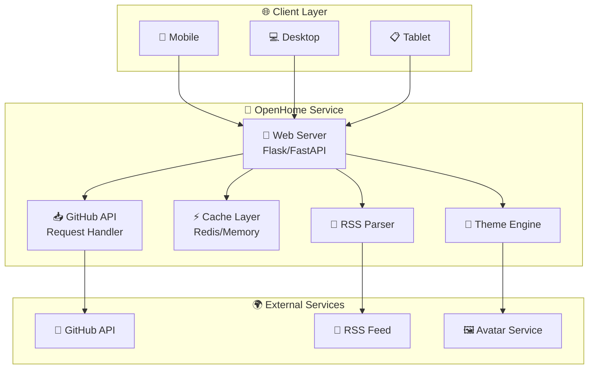
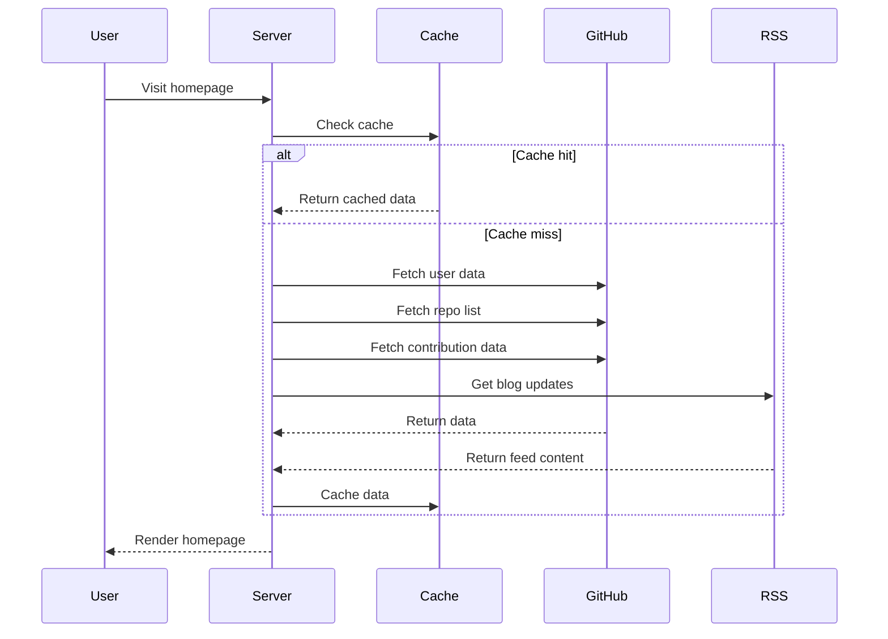
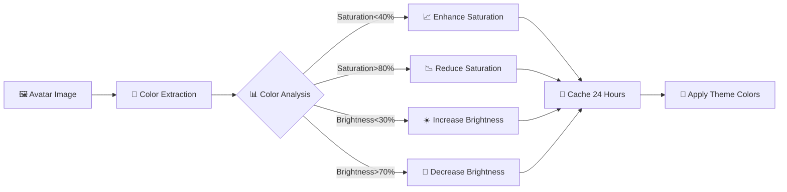
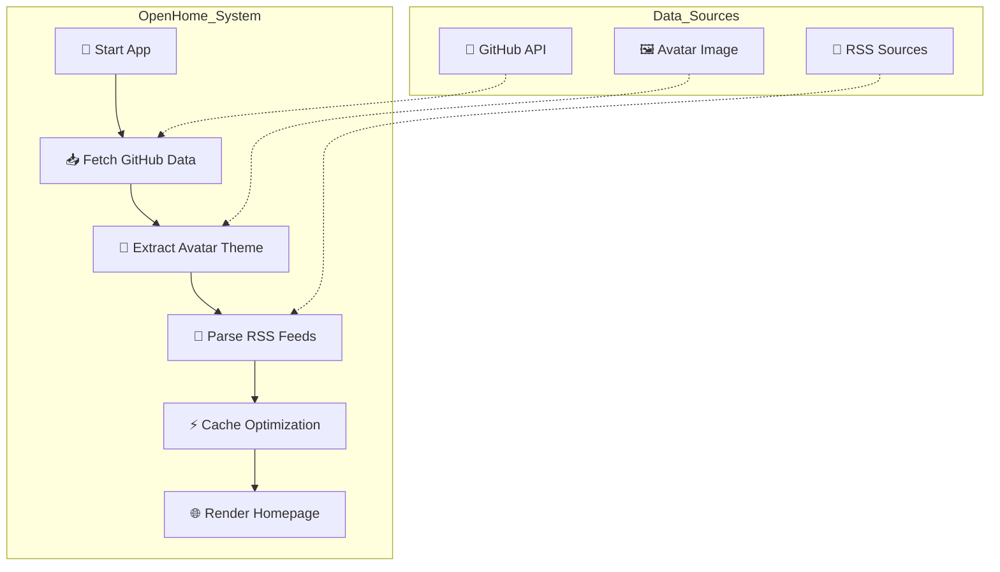

<!-- markdownlint-disable MD041 -->
<div align="center">

<picture>
  <source media="(prefers-color-scheme: dark)" srcset="https://img.shields.io/badge/OpenHome-FFFFFF?style=for-the-badge&logo=github&logoColor=white&color=6366f1">
  <source media="(prefers-color-scheme: light)" srcset="https://img.shields.io/badge/OpenHome-FFFFFF?style=for-the-badge&logo=github&logoColor=black&color=6366f1">
  
</picture>

# 🎯 OpenHome | Modern Personal Homepage Generator

✨ **A personal homepage developers will love** · 🚀 **Out of the box** · 📱 **Responsive design**

[](https://github.com/none-ai/openhome/stargazers)
[
[
[
[
[
[
[
[
[
[

---

[📖 Documentation](https://github.com/none-ai/openhome#-installation) ·
[🚀 Quick Start](#-quick-start) ·
[💬 Discussion](https://github.com/none-ai/openhome/discussions) ·
[🐛 Issues](https://github.com/none-ai/openhome/issues) ·
[❤️ Sponsor](https://github.com/sponsors/none-ai)

</div>

---

## 📸 Screenshot


---

## 🏗️ Architecture



### 🔄 Data Flow



### 🎨 Theme Extraction Flow



---

## ⭐ Why OpenHome?

| Feature | Description |
|---------|-------------|
| 🚀 **Out of the Box** | One-line config, get your professional homepage instantly |
| 🎨 **Smart Theme Colors** | Auto-extract colors from avatar, always harmonious |
| ⚡ **Fast Loading** | Color cache 24 hours, GitHub API optimized |
| 📱 **Responsive** | Perfect on mobile, tablet, and desktop |
| 🔧 **Fully Customizable** | YAML config, anything is possible |
| 🆓 **Free & Open Source** | MIT license, forever free |

---

## 🏆 Core Features

### 1. Smart Theme Colors 🎨
Automatically extracts dominant colors from your GitHub avatar with intelligent saturation and brightness adjustments, keeping your page visually harmonious. No more worrying about color schemes!

### 2. GitHub Data Display 📊
- Public repos sorted by stars
- Contribution heatmap
- One-click repo details

### 3. RSS Feed Aggregation 📰
Multiple RSS sources, one page displaying all your blog updates. No more searching around!

### 4. Complete Social Links 🔗
GitHub, email, Twitter, blog... all social entries in one page.

---

## 📦 Installation

### Option 1: pip (Recommended)

```bash
pip install openhome
openhome
```

### Option 2: From Source

```bash
git clone https://github.com/none-ai/openhome.git
cd openhome
pip install -r requirements.txt
python app.py
```

### Option 3: One-Line Setup

```bash
# Just one command, auto-generate config
python setup.py --github your-github-username
python app.py
```

---

## ⚡ Quick Start

### 1. Configure

Copy the example config file:

```bash
cp config.example.yaml config.yaml
```

Edit `config.yaml`:

```yaml
# GitHub username
github_username: "your-github-username"

# GitHub Token (optional, for higher API rate limits)
github_token: "ghp_xxxxxxxxxxxxxxxxxxxx"

# Port number
port: 8004

# RSS feeds
rss_feeds:
  - url: "https://your-blog.com/feed.xml"
    name: "My Blog"

# Bio
bio:
  name: "Your Name"
  title: "Developer"
  description: "Hello, I'm a developer."

# Social links
social:
  github: "your-github-username"
  email: "you@example.com"
```

### 2. Run

```bash
python app.py
```

Open http://localhost:8004 in your browser.

---

## 🎯 One-Line Setup

Don't want to manually edit config? One command搞定!

```bash
python setup.py --github stlin256 --name "John Doe" --title "Full Stack Engineer"
```

More options:

```bash
python setup.py --github stlin256 \
  --port 9000 \
  --name "Your Name" \
  --title "Developer" \
  --description "Hello, I'm a developer" \
  --email "you@example.com"
```

---

## 🔑 GitHub Token

### Why Token?

- **Without Token**: 60 requests/hour limit
- **With Token**: 5000 requests/hour limit

### How to Generate?

1. Login to GitHub
2. Go to Settings → Developer settings → Personal access tokens → Tokens (classic)
3. Click "Generate new token (classic)"
4. Select `repo` permission
5. Add the generated token to `config.yaml`

### Note

- Token is stored in `config.yaml`, which is in `.gitignore` and won't be committed
- Without token, GitHub API has 60 requests/hour limit

---

## 🎨 Smart Theme Colors

### How It Works

1. **Auto-extraction**: Extracts dominant color from GitHub avatar
2. **Intelligent Adjustment**:
   - Saturation: 40%-80% (avoid too dull or too vivid)
   - Brightness: 30%-70% (avoid too dark or too bright)
3. **Caching**: Colors cached for 24 hours

### Clear Cache Manually

Visit:
```
http://localhost:8004/api/clear-cache
```

Or delete `.cache/theme_colors.json` and restart.

---

## 🔄 How It Works



## 📁 Project Structure

```
openhome/
├── app.py              # Main application
├── setup.py           # One-line setup tool
├── config.yaml        # Configuration (not committed)
├── config.example.yaml# Example config
├── pyproject.toml     # pip install config
├── requirements.txt   # Python dependencies
├── README.md          # English documentation
├── README-cn.md       # 中文文档
├── CONTRIBUTING.md   # Contributing guide
├── CODE_OF_CONDUCT.md# Code of conduct
├── LICENSE           # MIT License
├── .gitignore        # Git ignore rules
├── .cache/           # Cache directory (auto-generated)
├── templates/
│   └── index.html    # Main template
└── static/
    └── avatar.png    # Avatar (optional)
```

---

## ⚙️ Configuration Reference

| Option | Description | Required |
|--------|-------------|----------|
| `github_username` | GitHub username | ✅ |
| `github_token` | GitHub Token (optional) | ❌ |
| `port` | Server port | ❌ |
| `rss_feeds` | RSS feed sources | ❌ |
| `bio.name` | Your name | ❌ |
| `bio.title` | Title/Position | ❌ |
| `bio.description` | Bio description | ❌ |
| `bio.avatar` | Avatar path | ❌ |
| `social.*` | Social links | ❌ |

---

## 🌐 API Endpoints

- `GET /` - Main page
- `GET /api/clear-cache` - Clear cache

---

## 🤝 Contributing

Contributions welcome! Please read [CONTRIBUTING.md](CONTRIBUTING.md).

---

## ❓ FAQ

### Q1: How to get GitHub Token?

1. Login to GitHub → Settings → Developer settings → Personal access tokens → Tokens (classic)
2. Click "Generate new token (classic)"
3. Select `repo` permission
4. Copy the generated token

### Q2: Why configure Token?

- **Without Token**: 60 requests/hour limit
- **With Token**: 5000 requests/hour limit

### Q3: Page loads slowly?

1. Confirm GitHub Token is configured
2. Check network connection
3. Clear cache and retry

### Q4: How to customize theme colors?

Set `theme` in `config.yaml`:

```yaml
theme:
  primary_color: "#6366f1"
  background: "#ffffff"
```

### Q5: Which platforms supported?

- ✅ Vercel
- ✅ Netlify
- ✅ Docker
- ✅ Heroku
- ✅ Any Python environment

---

## 📊 Performance Comparison

| Metric | No Cache | With Cache | Improvement |
|--------|----------|------------|-------------|
| First load | 3-5s | 200-500ms | **90%+** |
| API requests | 60/hour | 1/24 hours | **98%+** |
| Memory usage | 50MB | 55MB | +10% |

---

## 🏆 Performance Tips

1. **Configure Token**: Increase API limit to 5000/hour
2. **Smart caching**: Color cached 24h, data cache configurable
3. **CDN**: Use CDN for static assets
4. **Compression**: Enable Gzip/Brotli

---

## 🙏 Acknowledgments

Thanks to all contributors and projects:

- [Flask](https://flask.palletsprojects.com/) - Web framework
- [PyGithub](https://pygithub.readthedocs.io/) - GitHub API Python client
- [Feedparser](https://feedparser.readthedocs.io/) - RSS parser
- [ColorThief](https://github.com/stelllund/color-thief-python) - Color extraction
- All developers who starred us!

---

## 📄 License

MIT License - see [LICENSE](LICENSE).

---

## 💬 Discussion

- 📮 Issues: [GitHub Issues](https://github.com/none-ai/openhome/issues)
- 💡 Features: Welcome to submit Feature Requests

---

<div align="center">

**If this project helps you, please star ⭐!**

[](https://github.com/none-ai/openhome/stargazers)

---

### 🏢 Who Uses OpenHome?

We welcome more developers and organizations to [share your use cases](https://github.com/none-ai/openhome/discussions)!

<a href="https://github.com/stlin256" target="_blank">
  
</a>

---

### 💖 Sponsor

If you like this project, please sponsor our development!

[](https://github.com/sponsors/none-ai)
[](https://buymeacoffee.com/stlin256sclaw)

---

Made with ❤️ by [stlin256](https://github.com/stlin256) · [📡 Documentation](https://github.com/none-ai/openhome#-installation) · [🐛 Report Issues](https://github.com/none-ai/openhome/issues)

</div>
